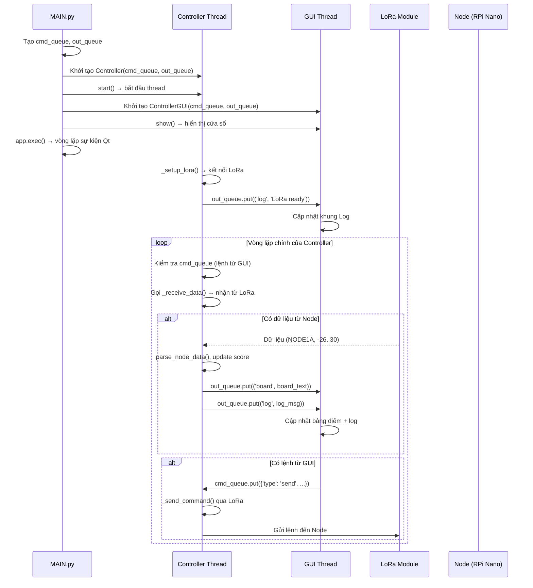
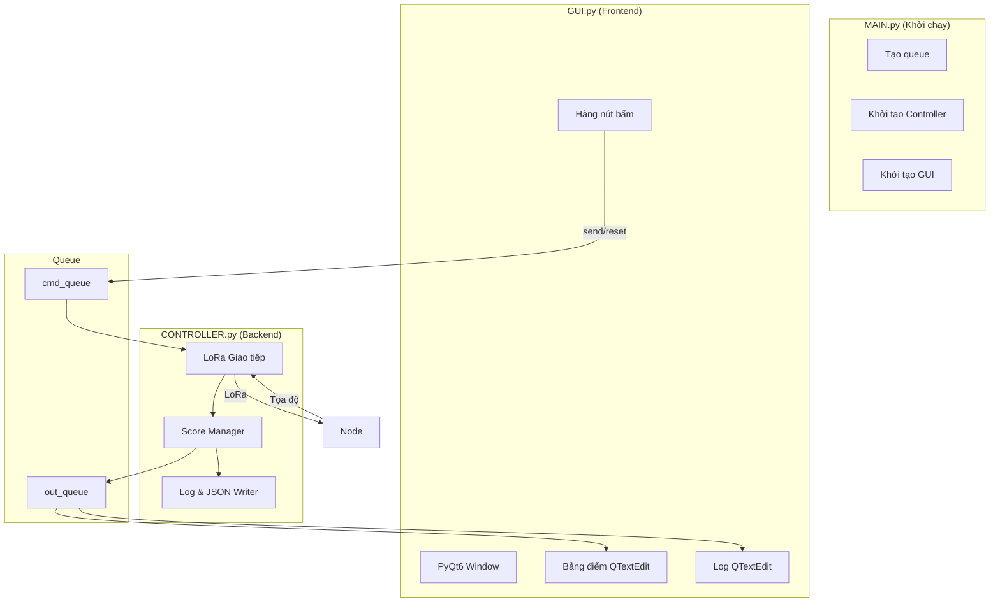
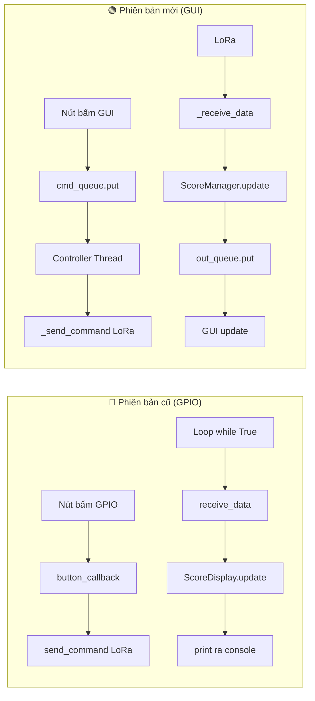

## sơ đồ giao tiếp giữa GUI <-> CONTROLLER qua Queue



---

## sơ đồ luồng khởi động hệ thống.


---

## sơ đồ kiến trúc tổng thể.



---

## so sánh kiến trúc cũ và mới.



---

## sơ đồ chi tiết về quá trình xử lý trong controller thread.

```mermaid
flowchart TD
    START([Controller.run]) --> INIT[Khởi tạo LoRa]
    INIT --> LOOP{while running}
    
    LOOP --> CHECK_CMD{cmd_queue có lệnh?}
    CHECK_CMD -->|Có| PROCESS_CMD{Xử lý lệnh}
    PROCESS_CMD -->|send| SEND[Gửi LoRa UP/DOWN]
    PROCESS_CMD -->|reset_round| RESET[ScoreManager.reset_round]
    PROCESS_CMD -->|exit| EXIT[Thoát vòng lặp]
    
    PROCESS_CMD --> NO_CMD
    CHECK_CMD -->|Không| NO_CMD[Kiểm tra LoRa]
    
    NO_CMD --> RECEIVE{_receive_data có dữ liệu?}
    RECEIVE -->|Có| PARSE[parse_node_data]
    PARSE --> UPDATE[ScoreManager.update]
    UPDATE --> SEND_OUT[Gửi board + log qua out_queue]
    UPDATE --> SAVE_FILE[Ghi JSON + score.txt]
    
    RECEIVE -->|Không| SLEEP[sleep 50ms]
    SEND_OUT --> SLEEP
    SAVE_FILE --> SLEEP
    SLEEP --> LOOP
    
    EXIT --> STOP([Dừng Controller])
'''

---

## sơ đồ cập nhật giao diện trong GUI thread (với signal / slot).

```mermaid
flowchart TD
    subgraph READER["Luồng đọc queue"]
        R1[_read_out_queue] --> R2{out_queue.get}
        R2 -->|log, board| R3[comm.update_log.emit<br/>comm.update_board.emit]
    end

    subgraph MAIN_THREAD["Thread chính PyQt6"]
        S1[comm.update_log signal] --> S2[append_log slot]
        S2 --> T1[log_text.append]
        
        S3[comm.update_board signal] --> S4[set_board_text slot]
        S4 --> T2[board_text.setPlainText]
    end

    R3 --> S1
    R3 --> S3
```