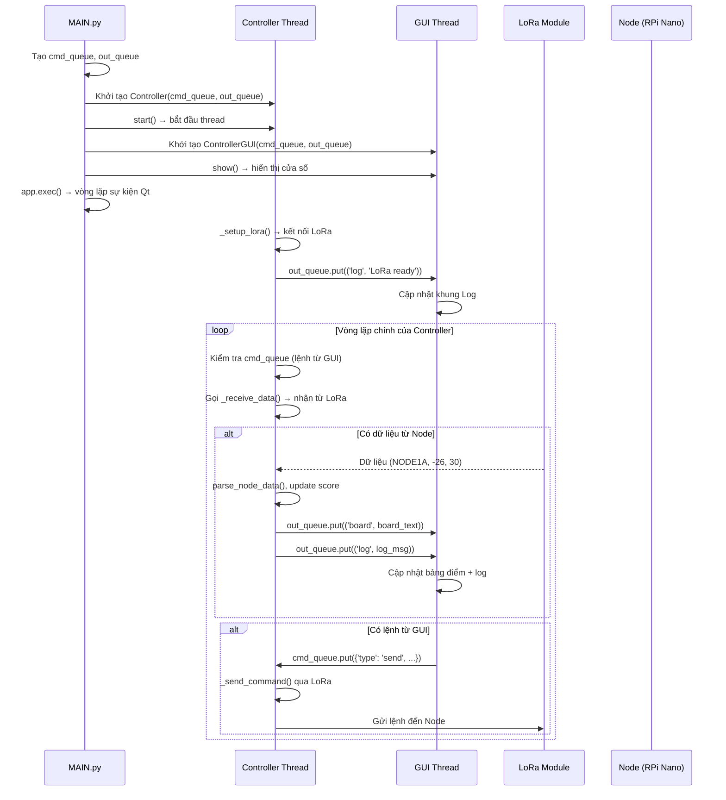

## sơ đồ giao tiếp giữa GUI <-> CONTROLLER qua Queue

```mermaid
sequenceDiagram
    participant MAIN as MAIN.py
    participant CTRL as Controller Thread
    participant GUI as GUI Thread
    participant LORA as LoRa Module
    participant NODE as Node (RPi Nano)

    MAIN->>MAIN: Tạo cmd_queue, out_queue
    MAIN->>CTRL: Khởi tạo Controller(cmd_queue, out_queue)
    MAIN->>CTRL: start() → bắt đầu thread
    MAIN->>GUI: Khởi tạo ControllerGUI(cmd_queue, out_queue)
    MAIN->>GUI: show() → hiển thị cửa sổ
    MAIN->>MAIN: app.exec() → vòng lặp sự kiện Qt

    CTRL->>CTRL: _setup_lora() → kết nối LoRa
    CTRL->>GUI: out_queue.put(('log', 'LoRa ready'))
    GUI->>GUI: Cập nhật khung Log

    loop Vòng lặp chính của Controller
        CTRL->>CTRL: Kiểm tra cmd_queue (lệnh từ GUI)
        CTRL->>CTRL: Gọi _receive_data() → nhận từ LoRa
        alt Có dữ liệu từ Node
            LORA-->>CTRL: Dữ liệu (NODE1A, -26, 30)
            CTRL->>CTRL: parse_node_data(), update score
            CTRL->>GUI: out_queue.put(('board', board_text))
            CTRL->>GUI: out_queue.put(('log', log_msg))
            GUI->>GUI: Cập nhật bảng điểm + log
        end

        alt Có lệnh từ GUI
            GUI->>CTRL: cmd_queue.put({'type': 'send', ...})
            CTRL->>CTRL: _send_command() qua LoRa
            CTRL->>LORA: Gửi lệnh đến Node
        end
    end
```