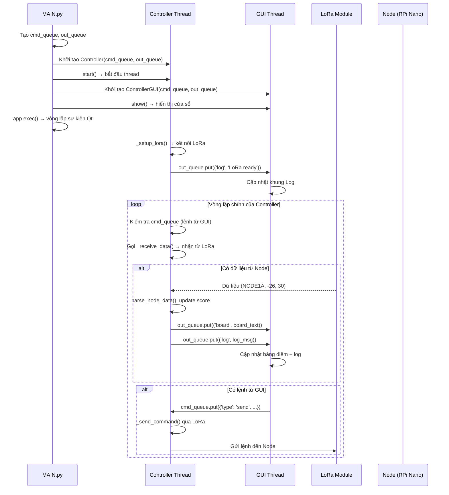

```markdown
# UPDATE: Nâng cấp Controller từ GPIO vật lý sang GUI PyQt6

## 📌 Tổng quan

Phiên bản cũ của Controller sử dụng **nút bấm vật lý** kết nối qua GPIO trên Raspberry Pi để gửi lệnh UP/DOWN đến các Node. Phiên bản mới thay thế các nút bấm vật lý bằng **giao diện đồ họa (GUI)** được xây dựng với PyQt6, đồng thời giữ nguyên toàn bộ logic xử lý dữ liệu LoRa, tính điểm, ghi log và JSON.

Bản nâng cấp này **tách biệt hoàn toàn phần hiển thị và phần xử lý logic** thông qua cơ chế hàng đợi (queue), giúp hệ thống ổn định hơn, dễ bảo trì và mở rộng.

---

## 🧠 So sánh kiến trúc giữa hai phiên bản

| Thành phần | Phiên bản cũ (GPIO) | Phiên bản mới (GUI) |
|------------|---------------------|---------------------|
| **Phần hiển thị** | Console (terminal) | PyQt6 GUI (cửa sổ đồ họa) |
| **Phần điều khiển** | Nút bấm GPIO vật lý | Nút bấm ảo trên màn hình |
| **Gửi lệnh đến Node** | Từ `button_callback()` gọi `send_command()` | GUI gửi lệnh qua queue → Controller xử lý |
| **Nhận dữ liệu từ Node** | Vòng lặp `while True` trong `main()` | Vòng lặp trong thread riêng của Controller |
| **Hiển thị bảng điểm** | In trực tiếp ra console | Gửi text qua queue → GUI hiển thị |
| **Log, debug** | In ra console + file | Gửi qua queue → GUI hiển thị + ghi file |
| **Cấu trúc chương trình** | Một file duy nhất (`CONTROLLER.py`) | Ba file: `CONTROLLER.py` (logic), `GUI.py` (giao diện), `MAIN.py` (khởi chạy) |
```
---

## 📂 Cấu trúc file sau nâng cấp

```

scripts/CONTROLLER/
        ├── CONTROLLER.py   # Backend: LoRa, tính điểm, quản lý dữ liệu (chạy trong thread)
        ├── GUI.py          # Frontend: PyQt6, hiển thị bảng điểm, log, nút bấm
        └── MAIN.py         # Khởi tạo queue, chạy hai thread (Controller + GUI)

```

---

## 🔄 Cơ chế giao tiếp giữa GUI và Controller

Hai thành phần **không gọi trực tiếp lẫn nhau**. Thay vào đó, chúng giao tiếp qua **hai hàng đợi (queue)** an toàn cho đa luồng.

```

┌─────────────────────────────────────────────────────────────────────────┐
│                                                                         │
│  ┌─────────────┐     cmd_queue      ┌─────────────────────────────┐    │
│  │             │ ─────────────────→ │                             │    │
│  │    GUI      │                     │      Controller Thread      │    │
│  │  (PyQt6)    │ ←───────────────── │  (LoRa, Score, JSON, Log)    │    │
│  │             │    out_queue       │                             │    │
│  └─────────────┘                     └─────────────────────────────┘    │
│                                                                         │
│  ■ cmd_queue:  GUI → Controller  (lệnh: send, reset_round, exit)       │
│  ■ out_queue:  Controller → GUI  (dữ liệu: log, board, score)          │
│                                                                         │
└─────────────────────────────────────────────────────────────────────────┘

```

### 📤 `cmd_queue` – Lệnh từ GUI đến Controller

Định dạng message JSON:

| Loại lệnh (`type`) | Ý nghĩa | Ví dụ |
|-------------------|---------|-------|
| `send` | Gửi lệnh UP/DOWN đến Node | `{"type": "send", "node": "NODE1", "command": "UP"}` |
| `reset_round` | Reset vòng bắn (pad miss, xoá shots) | `{"type": "reset_round"}` |
| `exit` | Yêu cầu Controller thoát | `{"type": "exit"}` |

### 📥 `out_queue` – Dữ liệu từ Controller đến GUI

Định dạng tuple `(type, content)`:

| Kiểu (`type`) | Nội dung | Hiển thị tại |
|---------------|----------|---------------|
| `log` | Chuỗi log (có timestamp) | Khung Log bên phải |
| `board` | Toàn bộ bảng điểm (dạng text) | Khung Bảng điểm bên trái |

---

## 🚀 Luồng khởi động hệ thống



Chi tiết từng bước:

1. MAIN.py được chạy đầu tiên (python3 MAIN.py).
2. Tạo hai hàng đợi: cmd_queue (GUI → Controller) và out_queue (Controller → GUI).
3. Khởi tạo Controller và chạy trong một thread riêng.
4. Khởi tạo ControllerGUI (PyQt6) và chạy trong thread chính (bắt buộc với Qt).
5. Controller thread tự động kết nối LoRa, bắt đầu vòng lặp:
   · Kiểm tra cmd_queue để xử lý lệnh từ GUI.
   · Gọi _receive_data() để nhận dữ liệu từ Node qua LoRa.
   · Nếu có dữ liệu → parse, cập nhật điểm, ghi log, gửi bảng điểm qua out_queue.
6. GUI thread đọc out_queue trong một luồng phụ, phát tín hiệu (pyqtSignal) để cập nhật giao diện an toàn.
7. Khi đóng cửa sổ, MAIN.py gửi lệnh exit qua cmd_queue và chờ Controller thread kết thúc.

---

🧩 Cách Controller mới điều khiển Node và nhận dữ liệu

✨ Điểm khác biệt quan trọng

Tính năng Phiên bản cũ (GPIO) Phiên bản mới (GUI)
Vòng lặp chính while True trong main() Vòng lặp trong Controller.run()
Khởi tạo LoRa Trong setup() Trong Controller._setup_lora()
Gửi lệnh đến Node Từ button_callback() (GPIO) Từ cmd_queue (do GUI gửi)
Nhận dữ liệu từ Node receive_data() trong vòng lặp _receive_data() trong vòng lặp
Cập nhật điểm Trực tiếp trên ScoreDisplay Qua ScoreManager (giữ nguyên logic)
Hiển thị kết quả In trực tiếp ra console Gửi qua out_queue lên GUI

📡 Gửi lệnh UP/DOWN

Khi người dùng nhấn nút trên GUI:

```python
# Trong GUI.py
def _on_node_clicked(self, node_number):
    self.cmd_queue.put({
        'type': 'send',
        'node': f"NODE{node_number}",
        'command': 'UP'
    })
```

Controller nhận lệnh và gửi qua LoRa:

```python
# Trong CONTROLLER.py
def _send_command(self, node_name, command):
    message = f"{node_name} {command}"
    self.lora.send(message.encode())
    log_data(f"[TX] Sent: {message}", self.out_queue)
```

📥 Nhận dữ liệu từ Node

Controller liên tục kiểm tra LoRa:

```python
# Trong CONTROLLER.py - vòng lặp run()
data = self._receive_data()
if data:
    node_name, x, y = parse_node_data(data)
    if node_name:
        self.score_manager.update(node_name, x, y)
```

Sau khi cập nhật điểm, ScoreManager tự động:

· Gửi bảng điểm mới qua out_queue
· Gửi log chi tiết qua out_queue
· Ghi file score.txt
· Ghi file score_data.json

🖥️ GUI cập nhật giao diện

Luồng đọc out_queue trong GUI.py:

```python
def _read_out_queue(self):
    while True:
        data = self.out_queue.get(timeout=0.1)
        if data[0] == 'log':
            self.comm.update_log.emit(data[1])   # Cập nhật log
        elif data[0] == 'board':
            self.comm.update_board.emit(data[1]) # Cập nhật bảng điểm
```

Các tín hiệu (pyqtSignal) được kết nối với slot tương ứng, đảm bảo việc cập nhật giao diện diễn ra trong thread chính của Qt (an toàn).

---

✅ Lợi ích của việc nâng cấp

Lợi ích Mô tả
Tách biệt logic và hiển thị Dễ bảo trì, sửa GUI không ảnh hưởng đến xử lý LoRa
Giao diện trực quan hơn Bảng điểm, log, nút bấm rõ ràng, dễ sử dụng
Dễ mở rộng Có thể thêm biểu đồ, âm thanh, lưu lịch sử dễ dàng
Ổn định cao Thread Controller và GUI chạy độc lập, không bị treo
Không phụ thuộc GPIO Có thể chạy trên máy tính không có GPIO để test GUI
Tiết kiệm phần cứng Không cần nút bấm vật lý và dây nối

---

🔧 Yêu cầu cài đặt

```bash
# Cài đặt PyQt6
pip install PyQt6

# Các thư viện khác đã có từ phiên bản cũ
# rpi-lora, numpy, scipy, RPi.GPIO (chỉ cần trên RPi)
```

---

📁 File tương ứng

File Chức năng
scripts/CONTROLLER/CONTROLLER.py Backend: LoRa, tính điểm, quản lý dữ liệu
scripts/CONTROLLER/GUI.py Frontend: PyQt6, hiển thị, nút bấm
scripts/CONTROLLER/MAIN.py Khởi chạy, quản lý hai thread

---

📝 Ghi chú

· Toggle UP/DOWN: Phiên bản hiện tại mỗi lần nhấn nút chỉ gửi UP. Bạn có thể mở rộng bằng cách thêm biến trạng thái trong GUI hoặc Controller để gửi DOWN khi cần.
· Thread safety: Tất cả giao tiếp giữa các thread đều qua queue.Queue, không dùng biến toàn cục.
· Dừng chương trình: Nhấn Ctrl+C trong terminal hoặc đóng cửa sổ GUI đều gửi lệnh exit đến Controller thread.

---

Ngày cập nhật: 2026-05-02
Tác giả: HTTDTD_v2 | Chiêm Dũng.

